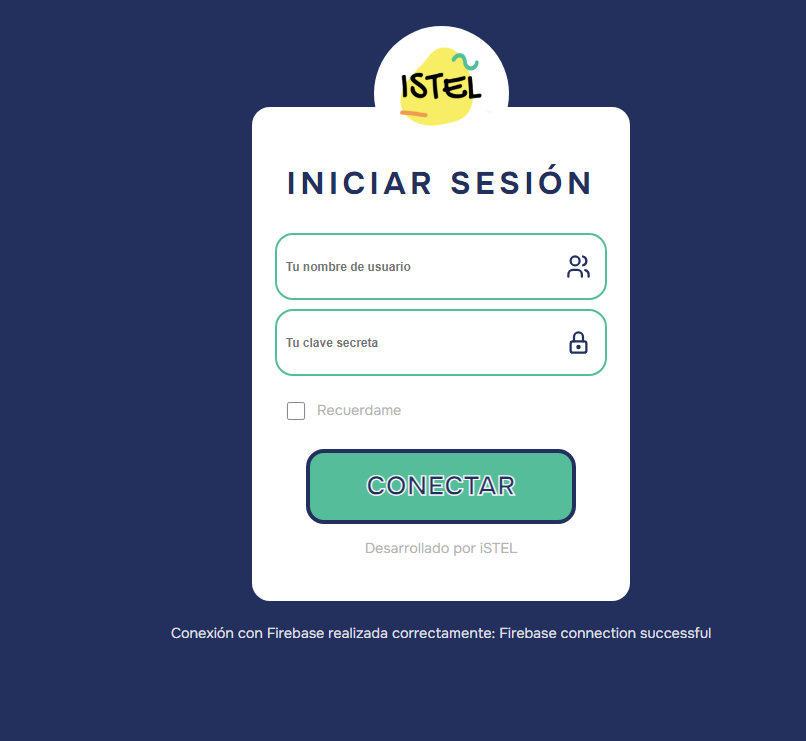

# Login del Sistema de Verificación de Cuadros

## Interfaz



## Pasos para correr el proyecto

- Entrar en la ruta del proyecto
```sh
cd ruta_proyecto
```

- Instalar las dependencias necesarias del proyecto:

```sh
npm install
```

- Correr el proyecto:

```sh
npm run dev
```